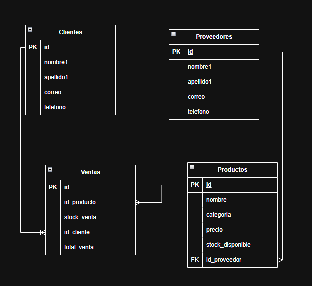
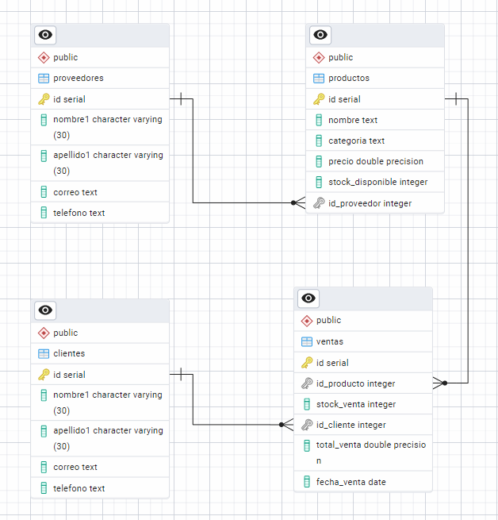

# Gestión de Inventario para una tienda de Tecnología

## Introducción
Desarrollar una base de datos para el manejo de procedimeintos de una tienda de tecnología. Esto como fin de presentar el éxamen que marca el final del módulo de PostgreSQL.

## Problema
La tienda TechZone es un negocio dedicado a la venta de productos tecnológicos, desde laptops y
teléfonos hasta accesorios y componentes electrónicos. Con el crecimiento del comercio digital y
la alta demanda de dispositivos electrónicos, la empresa ha notado la necesidad de mejorar la
gestión de su inventario y ventas. Hasta ahora, han llevado el control de productos y
transacciones en hojas de cálculo, lo que ha generado problemas
1. Errores en el control de stock
2. Dificultades en el seguimiento de ventas
3. Gestión manual de proveedores
4. Falta de automatización en el registro de compras

## Entidades
1. Clientes
2. Productos
3. Ventas
4. Proveedores

## Modelo Entidad-Relación


## Modelo lógico

## Propósito de la función
Valida la existencia del cliente en la base de datos. Esto con el fin de darle uso en el procedimeinto "registrar_venta" 
* Si el cliente existe retorna el id del cliente. 
* No existe retorna null. 

```sql
create or replace function validacion_cliente(id_clienteI int)
returns int as $$
declare 
 existe boolean;
begin
	-- Validar que el cliente exista.
	select 1 into existe from clientes where id= id_clienteI;

	if existe is null then return null;
	end if;
	return id_clienteI;
end;
$$ language plpgsql;
```

### Probar la función
* Cliente existente
````sql
select validacion_cliente(2);
````

* cliente no existente
````sql
select validacion_cliente(1);
````

## Propósito del procedimiento
Verificar una venta antes de insertarla.
* Verifica si el cliente existe
* Si el cliente no existe, notifica por medio de un mensaje en consola.
* Verifica que el stock sea suficiente antes de procesar la venta.
* Si no hay stock suficiente, notifica por medio de un mensaje en consola.
* Si el stock es suficiente actualiza el inventario en la tabla productos.

```sql
create or replace procedure registrar_venta(id_clienteI int,id_productoI int, stock_ventaI int)
language plpgsql as $$
declare 
	stock_actual int;
	PrecioV double precision;
	NuevoStock int;
	existe int;
begin
	select validacion_cliente(id_clienteI) into existe;
	if existe is null then raise exception 'ERROR: El cliente no existe';
	end if;
	
	select stock_disponible, sum(stock_ventaI * precio) into stock_actual, PrecioV from productos where id=id_productoI
	group by 1;

	-- Verificar que el stock sea suficiente antes de procesar la venta.
	-- Si no hay stock suficiente, Notificar por medio de un mensaje en consola usando RAISE.
	if stock_actual<stock_ventaI then raise exception 'ERROR: Cantidad de Stock insuficiente';
	end if;
	
	-- Si hay stock, se realiza el registro de la venta.
	insert into ventas(id_producto,stock_venta,id_cliente,total_venta,fecha_venta)
	values (id_productoI, stock_ventaI, id_clienteI, PrecioV,  now());

	select stock_disponible - stock_ventaI into NuevoStock from productos
	where id= id_productoI;

	update productos set stock_disponible = NuevoStock where id= id_productoI;
	
end;
$$;
````

### Probar la función
* Probar procedimeinto funcional con el cliente existente
```sql
    call registrar_venta(2,5,2);
````

* ``MENSAJE DE ERROR`` -> Probar procedimiento con un cliente inexistente
```sql
    call registrar_venta(1,5,2);
````

* ``MENSAJE DE ERROR`` -> Probar procedimiento para mostrar que hay stock insuficiente

```sql
    call registrar_venta(12,12,15);
````
* Mostrar la nueva venta
```sql
    select * from ventas order by id desc limit 1;
````
* Mostrar el stock actualizado
```sql
    select * from productos;
````

### Probar consultas
````sql
-- 1. Listar los productos con stock menor a 5 unidades.
select * from productos where stock_disponible<5;

-- 2. Calcular ventas totales de un mes específico.
select sum(total_venta) from ventas where fecha_venta= '2025-01-01';

-- 3. Obtener el cliente con más compras realizadas.
select nombre1,count(id_cliente) from ventas 
inner join clientes on ventas.id_cliente= clientes.id
group by 1 order by 2 desc limit 1;

-- 4. Listar los 5 productos más vendidos.
select nombre,count(id_producto) from ventas 
inner join productos on ventas.id_cliente= productos.id
group by 1 order by 2 desc limit 1;

-- 5. Consultar ventas realizadas en un rango de fechas de tres Días y un Mes.
select count(id) from ventas where fecha_venta >='2025-01-01' and fecha_venta<='2025-02-03';

-- 6. Identificar clientes que no han comprado en los últimos 6 meses.
select fecha_venta, nombre1 from ventas 
inner join clientes on ventas.id_cliente= clientes.id
where fecha_venta<= now() - interval '6 month';
````
## Importar archivos
* Descarga el repositorio con el link ``https://github.com/MichelLasso/EXAMEN_POSTGRESQL_ValerieLasso.git``

* Abrir pgAdmin y abrir los archivos clonados.
* Ejecutar con el botón de play
1. Las tablas
2. Las inserciones.
3. Consultas.
4. Función y el procedimiento.
## Bases de datos utilizadas
* PostgreSQL 16.8-> pgAdmin4
## Créditos
* Valerie Michel Lasso Lizcano

### Contacto
valerie01liz01@gmail.com